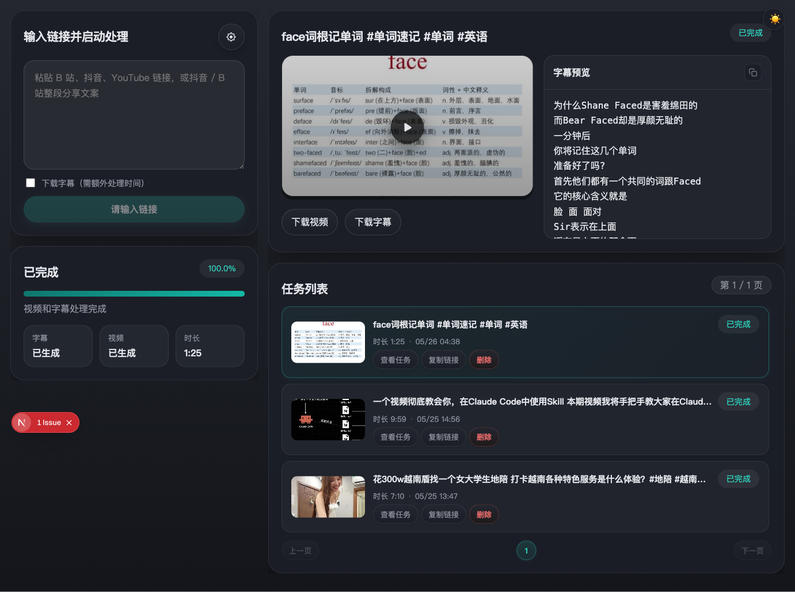
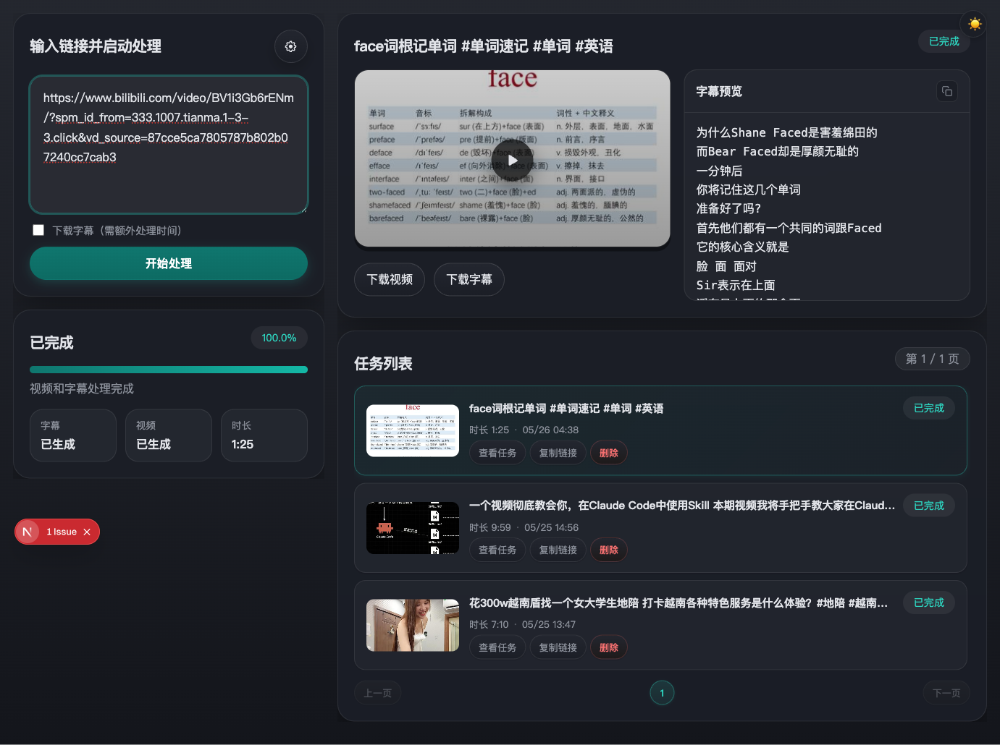
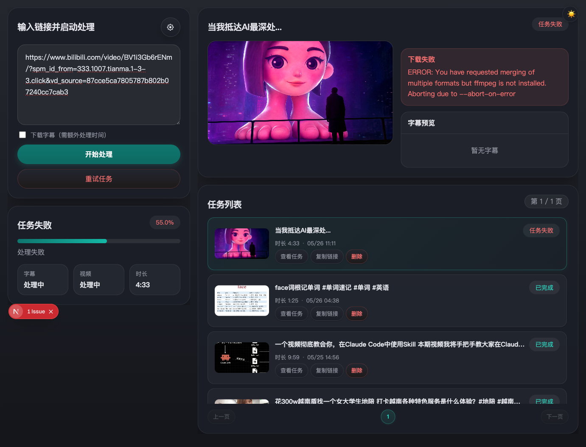
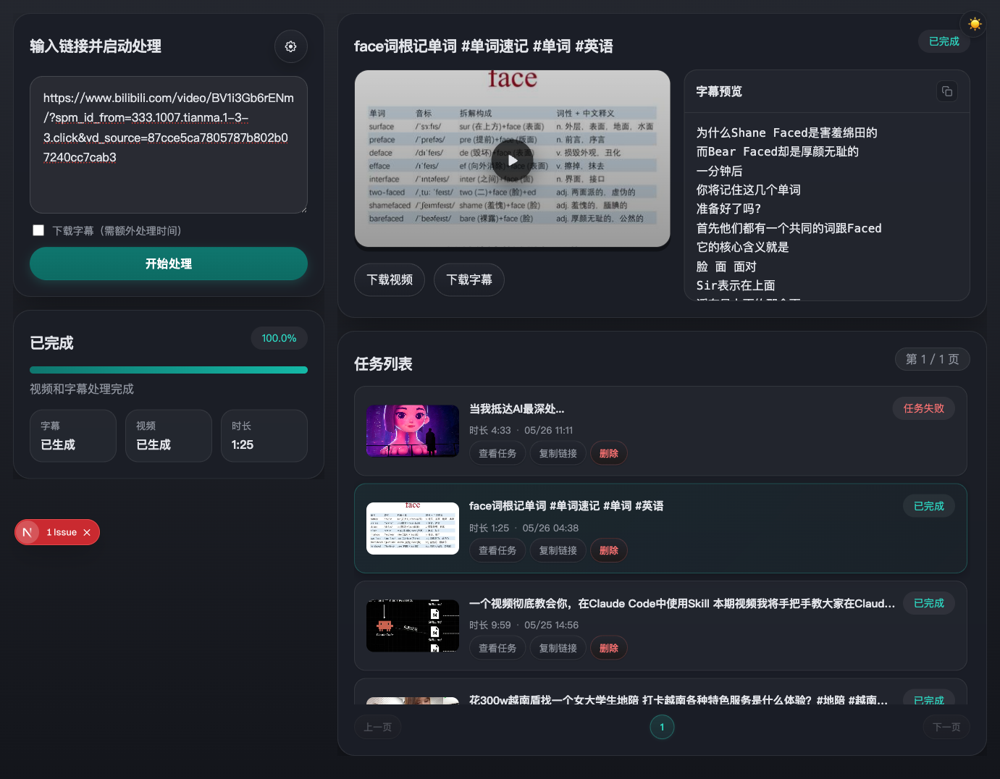
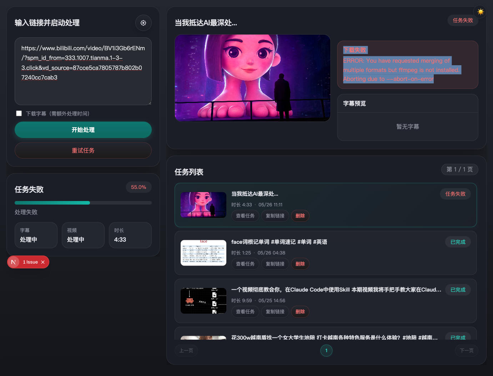
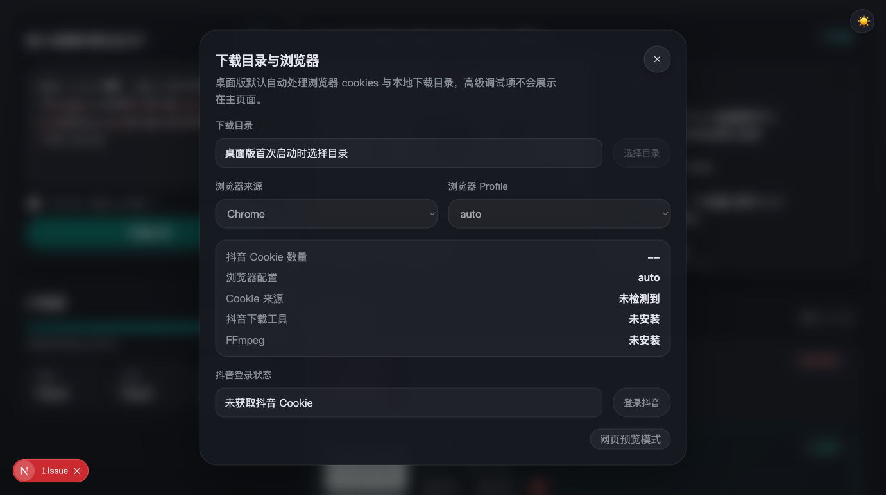
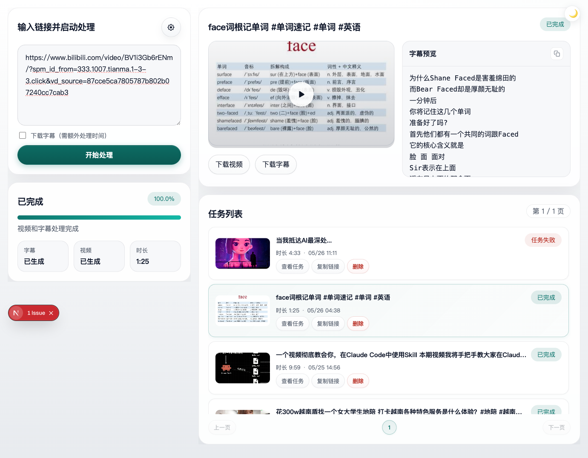

# B站抖音下载器

本地优先的视频下载工具，支持 **B站（Bilibili）**、**YouTube** 和 **抖音（Douyin）** 三大平台的视频下载与字幕提取。桌面客户端运行，所有数据本地处理，无需注册账号，即开即用。

## 功能特性

| 功能 | 说明 |
|------|------|
| 视频下载 | 支持 B站、YouTube、抖音视频一键下载 |
| 字幕提取 | 自动提取内嵌字幕，或通过 AI 语音转写生成 |
| 视频预览 | 内置播放器，下载完成后可直接预览 |
| 历史管理 | 所有下载任务自动保存，支持查看、重试、删除 |
| 深色/浅色模式 | 支持主题切换，适配不同使用环境 |
| 抖音 Cookie 登录 | 内置浏览器登录流程，轻松获取抖音下载权限 |

## 快速开始（开发）

### 后端

```bash
cd backend
python3 -m venv .venv && source .venv/bin/activate
pip install -r requirements.txt
QUEUE_MODE=inline uvicorn app.main:app --reload --port 8000
```

> `QUEUE_MODE=inline` 无需 Redis/Worker，适合本地开发。生产模式使用 `redis` 并另启 `python worker.py`。

### 前端

```bash
cd web
npm install && npm run dev
```

- 前端：`http://localhost:3000`
- 后端：`http://localhost:8000`

### 桌面客户端

```bash
cd desktop
npm install
npm run dev:full          # 开发模式
npm run dist:mac          # 构建 macOS DMG
npm run dist:win          # 构建 Windows 安装包
```

> 构建前需先执行 `cd web && npm run build:desktop` 导出前端静态资源。

### Docker

```bash
docker-compose up --build
```

## 技术栈

- **前端**：Next.js + React
- **后端**：FastAPI + Redis + RQ
- **桌面壳**：Electron
- **下载引擎**：yt-dlp + ffmpeg
- **字幕转写**：faster-whisper
- **抖音支持**：douyin-downloader（外部项目）

---

# 使用说明

## 软件简介

B站抖音下载器是一款本地优先的视频下载工具，支持 **B站（Bilibili）**、**YouTube** 和 **抖音（Douyin）** 三大平台的视频下载与字幕提取。软件采用桌面客户端形式运行，所有数据均在本地处理，无需注册账号，即开即用。

### 核心功能

| 功能 | 说明 |
|------|------|
| 视频下载 | 支持 B站、YouTube、抖音视频一键下载 |
| 字幕提取 | 自动提取视频内嵌字幕，或通过 AI 语音转写生成字幕 |
| 视频预览 | 内置播放器，下载完成后可直接预览 |
| 历史管理 | 所有下载任务自动保存，支持查看、重试、删除 |
| 深色/浅色模式 | 支持主题切换，适配不同使用环境 |
| 抖音 Cookie 登录 | 内置浏览器登录流程，轻松获取抖音下载权限 |

---

## 界面总览

软件界面分为两大区域：左侧为 **操作控制栏**，右侧为 **结果展示区**。



- **左侧控制栏**：包含链接输入框、下载选项、进度显示和状态信息
- **右侧展示区**：显示当前任务的缩略图、字幕预览和操作按钮
- **底部任务列表**：展示所有历史下载任务，支持分页浏览

---

## 快速开始

### 第一步：输入视频链接

在左侧控制栏的文本框中，粘贴你要下载的视频链接。支持以下格式：

- **B站**：`https://www.bilibili.com/video/BVxxxxxxx` 或 B站分享文案
- **抖音**：`https://www.douyin.com/video/xxxxxxx` 或抖音分享文案
- **YouTube**：`https://www.youtube.com/watch?v=xxxxxxx`



> **提示**：你也可以直接粘贴从手机复制的整段分享文案（如「#xxx 复制打开抖音...」），软件会自动识别其中的链接。

### 第二步：选择是否下载字幕

勾选「下载字幕（需额外处理时间）」选项后，软件会在下载视频的同时尝试获取或生成字幕：

- **内嵌字幕**：优先提取视频已有的字幕轨
- **自动转写**：若视频无字幕，将使用 AI 语音识别自动生成

### 第三步：点击「开始处理」

点击按钮后，软件将自动开始解析和下载：



下载过程中可以实时看到：
- 当前任务状态（解析元数据 → 下载视频 → 提取字幕）
- 进度百分比
- 字幕和视频的处理状态

---

## 任务结果

### 下载成功

任务完成后，右侧展示区会显示视频封面缩略图，并提供以下操作：



- **播放视频**：点击缩略图上的播放按钮，打开内置播放器
- **下载视频**：将视频文件保存到本地（网页模式下可用）
- **下载字幕**：将字幕文本保存为 `.txt` 文件
- **复制字幕**：一键复制字幕内容到剪贴板

#### 视频播放器

点击缩略图上的播放按钮，即可在弹出的播放器中预览视频：


### 下载失败

如果下载过程中遇到问题，界面会显示具体的错误信息，并提供「重试任务」按钮：



常见失败原因：
- **ffmpeg 未安装**：视频合并需要 ffmpeg，请确保系统已安装
- **Cookie 过期**：抖音视频需要有效的登录 Cookie，请重新登录
- **网络问题**：检查网络连接是否正常
- **链接无效**：确认视频链接是否正确

---

## 设置面板

点击左上角的齿轮图标打开设置面板：



### 下载目录

在桌面客户端中，可以自定义视频的下载保存位置。点击「选择目录」按钮，在弹出的系统对话框中选择目标文件夹。

### 浏览器配置

软件需要读取浏览器 Cookie 来下载需要登录的视频（如抖音）。你可以选择：

- **浏览器来源**：Chrome / Edge / Safari
- **浏览器 Profile**：选择对应的浏览器配置文件（如 Default、Profile 1）

### 抖音 Cookie 登录

下载抖音视频需要有效的登录 Cookie。设置面板提供了一键登录功能：

1. 点击「登录抖音」按钮，软件会在你的默认浏览器中打开抖音
2. 在浏览器中完成抖音账号登录
3. 回到软件，点击「已完成登录」按钮导入 Cookie
4. 系统会显示获取到的 Cookie 数量，确认后即可下载抖音视频

### 诊断信息

设置面板底部展示了当前环境的诊断信息：

- **抖音 Cookie 数量**：当前已获取的 Cookie 数
- **浏览器配置**：正在使用的浏览器 Profile
- **Cookie 来源**：Cookie 的读取方式
- **抖音下载工具**：抖音下载器是否已安装就绪
- **FFmpeg**：视频处理工具是否已安装

---

## 任务列表

界面底部显示所有历史下载任务，每条记录包含：

- 视频缩略图
- 视频标题
- 任务状态（已完成 / 任务失败 / 排队中 等）
- 视频时长
- 下载时间


### 任务操作

每个任务提供以下快捷操作：

| 操作 | 说明 |
|------|------|
| 查看任务 | 在右侧展示区查看该任务的详细信息 |
| 复制链接 | 复制视频原始链接到剪贴板 |
| 终止 | 终止正在进行的任务 |
| 删除 | 删除任务记录及其本地文件 |

### 分页导航

当任务数量较多时，任务列表自动分页，可通过底部的页码按钮切换页面。

---

## 主题切换

软件支持深色和浅色两种主题模式。点击右上角的太阳/月亮图标即可切换：

- **深色模式**（默认）：适合夜间使用，减少眼睛疲劳
- **浅色模式**：适合白天使用，界面更明亮



---

## 常见问题

### Q：下载抖音视频提示 Cookie 失效怎么办？

打开设置面板，点击「登录抖音」重新获取 Cookie。确保在浏览器中登录的是你常用的抖音账号。

### Q：下载的视频无法播放？

部分视频格式可能需要转码。如果界面上出现「转为兼容格式」按钮，点击即可自动转码。

### Q：如何查看已下载的文件？

- **桌面客户端**：点击任务操作中的「打开目录」按钮，直接打开文件所在文件夹
- **网页模式**：点击「下载视频」/「下载字幕」链接保存文件

### Q：下载速度慢怎么办？

下载速度取决于你的网络环境和视频源服务器。建议在网络状况良好时使用。

### Q：字幕生成失败怎么办？

字幕生成依赖 AI 语音识别模型。如果生成失败，可以尝试：
1. 重新提交任务并勾选「下载字幕」选项
2. 如果视频本身有内嵌字幕，软件会优先提取内嵌字幕
